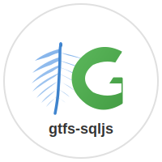

<div align="center">
  
  <h1>gtfs-sqljs</h1>
  <p>A TypeScript library for loading GTFS (General Transit Feed Specification) data into a sql.js SQLite database for querying in both browser and Node.js environments.</p>
</div>

## Author

**Théophile Helleboid / SysDevRun**

- Email: contact@sys-dev-run.fr
- Website: https://www.sys-dev-run.fr/

## Documentation & Demo

📚 **[View Documentation and Interactive Demo](https://sysdevrun.github.io/gtfs-sqljs/)**

Try the live demo to explore GTFS data, view routes with colors, and see trip schedules in action!

## Features

### GTFS Static Data
- ✅ Load GTFS data from ZIP files (URL or local path)
- ✅ **High-performance loading** - 7-8x faster than previous versions
- ✅ **Progress tracking** - Real-time progress callbacks (0-100%)
- ✅ Skip importing specific files (e.g., shapes.txt) to reduce memory usage
- ✅ Load existing SQLite databases
- ✅ Export databases to ArrayBuffer for persistence
- ✅ Flexible filter-based query API - combine multiple filters easily
- ✅ Agency query support with agency-based filtering
- ✅ Full TypeScript support with comprehensive types
- ✅ Works in both browser and Node.js
- ✅ Efficient querying with indexed SQLite database
- ✅ Proper handling of GTFS required/optional fields
- ✅ Active service detection based on calendar/calendar_dates
- ✅ Optimized bulk loading with transactions and batch inserts

### GTFS Realtime Support
- ✅ Load GTFS-RT data from protobuf feeds (URLs or local files)
- ✅ Support for Alerts, Trip Updates, and Vehicle Positions
- ✅ Automatic staleness filtering (configurable threshold)
- ✅ Active alert period checking
- ✅ Merge realtime data with static schedules
- ✅ Filter alerts and vehicle positions by route, stop, or trip
- ✅ Store RT data in SQLite for consistent querying
- ✅ Include RT data in database exports
- ✅ Full support for both GTFS-RT `time` and `delay` fields in stop time updates

### Smart Caching
- ✅ **Automatic caching** - Enabled by default, no configuration needed
- ✅ **Platform-optimized storage** - IndexedDB (browser) or FileSystem (Node.js)
- ✅ **Smart invalidation** - Based on file checksum, size, version, and library version
- ✅ **Automatic expiration** - Configurable (default: 7 days)
- ✅ **Cache management API** - Get stats, clean expired entries, clear cache
- ✅ **Custom cache stores** - Implement your own (Redis, S3, etc.)
- ✅ **Dramatic speed improvement** - Subsequent loads in <1 second

## Migration Guide (v1.0.0+)

If you're upgrading from an earlier version, the API has been simplified and improved:

### Unified Filter-Based API

All `getXXXByYYYY` methods have been removed in favor of unified `getXXXX` methods with optional filters. Filters now support both single values and arrays for maximum flexibility.

**Migration examples:**

```typescript
// ❌ Old API
const stop = gtfs.getStopById('STOP_123');
const route = gtfs.getRouteById('ROUTE_1');
const trip = gtfs.getTripById('TRIP_123');
const stopTimes = gtfs.getStopTimesByTrip('TRIP_123');
const agency = gtfs.getAgencyById('AGENCY_1');
const alert = gtfs.getAlertById('alert:123');
const vehicle = gtfs.getVehiclePositionByTripId('TRIP_123');

// ✅ New API
const stops = gtfs.getStops({ stopId: 'STOP_123' });
const stop = stops.length > 0 ? stops[0] : null;

const routes = gtfs.getRoutes({ routeId: 'ROUTE_1' });
const route = routes.length > 0 ? routes[0] : null;

const trips = gtfs.getTrips({ tripId: 'TRIP_123' });
const trip = trips.length > 0 ? trips[0] : null;

const stopTimes = gtfs.getStopTimes({ tripId: 'TRIP_123' });

const agencies = gtfs.getAgencies({ agencyId: 'AGENCY_1' });
const agency = agencies.length > 0 ? agencies[0] : null;

const alerts = gtfs.getAlerts({ alertId: 'alert:123' });
const alert = alerts.length > 0 ? alerts[0] : null;

const vehicles = gtfs.getVehiclePositions({ tripId: 'TRIP_123' });
const vehicle = vehicles.length > 0 ? vehicles[0] : null;
```

**Benefits of the new API:**
- ✅ Support for filtering by multiple IDs at once (arrays)
- ✅ More consistent API surface
- ✅ Easier to combine multiple filters
- ✅ Better TypeScript inference

**Array filtering example:**
```typescript
// Get multiple stops at once
const stops = gtfs.getStops({ stopId: ['STOP_1', 'STOP_2', 'STOP_3'] });

// Get trips for multiple routes
const trips = gtfs.getTrips({ routeId: ['ROUTE_1', 'ROUTE_2'], date: '20240115' });

// Get stop times for multiple trips
const stopTimes = gtfs.getStopTimes({ tripId: ['TRIP_1', 'TRIP_2'] });
```

### GTFS-RT Time/Delay Support

Stop time updates now include both `time` and `delay` fields:

```typescript
const stopTimes = gtfs.getStopTimes({
  tripId: 'TRIP_123',
  includeRealtime: true
});

for (const st of stopTimes) {
  if (st.realtime) {
    // Both delay (relative to schedule) and time (absolute) are now available
    console.log('Arrival delay:', st.realtime.arrival_delay, 'seconds');
    console.log('Arrival time:', st.realtime.arrival_time, '(UNIX timestamp)');
    console.log('Departure delay:', st.realtime.departure_delay, 'seconds');
    console.log('Departure time:', st.realtime.departure_time, '(UNIX timestamp)');
  }
}
```

## Installation

```bash
npm install gtfs-sqljs
```

You also need to install sql.js as a peer dependency:

```bash
npm install sql.js
```

## Loading the sql.js WASM File

sql.js requires a WASM file to be loaded. There are several ways to handle this:

### Node.js

In Node.js, sql.js will automatically locate the WASM file from the installed package:

```typescript
import { GtfsSqlJs } from 'gtfs-sqljs';

// The WASM file is loaded automatically
const gtfs = await GtfsSqlJs.fromZip('path/to/gtfs.zip');
```

### Browser with CDN

You can use a CDN to serve the WASM file:

```typescript
import initSqlJs from 'sql.js';
import { GtfsSqlJs } from 'gtfs-sqljs';

// Initialize sql.js with CDN WASM file
const SQL = await initSqlJs({
  locateFile: (filename) => `https://sql.js.org/dist/${filename}`
});

// Pass the SQL instance to GtfsSqlJs
const gtfs = await GtfsSqlJs.fromZip('https://example.com/gtfs.zip', { SQL });
```

### Browser with Bundler (Webpack, Vite, etc.)

If you're using a bundler, you need to configure it to handle the WASM file:

#### Vite

```typescript
import initSqlJs from 'sql.js';
import { GtfsSqlJs } from 'gtfs-sqljs';
import sqlWasmUrl from 'sql.js/dist/sql-wasm.wasm?url';

const SQL = await initSqlJs({
  locateFile: () => sqlWasmUrl
});

const gtfs = await GtfsSqlJs.fromZip('https://example.com/gtfs.zip', { SQL });
```

#### Webpack

```typescript
import initSqlJs from 'sql.js';
import { GtfsSqlJs } from 'gtfs-sqljs';

const SQL = await initSqlJs({
  locateFile: (filename) => `/path/to/public/${filename}`
});

const gtfs = await GtfsSqlJs.fromZip('https://example.com/gtfs.zip', { SQL });
```

Make sure to copy `sql-wasm.wasm` from `node_modules/sql.js/dist/` to your public directory.

## Usage

### Creating an Instance

#### From a GTFS ZIP file

```typescript
import { GtfsSqlJs } from 'gtfs-sqljs';

// From URL
const gtfs = await GtfsSqlJs.fromZip('https://example.com/gtfs.zip');

// From local file (Node.js)
const gtfs = await GtfsSqlJs.fromZip('./path/to/gtfs.zip');

// Skip importing specific files to reduce memory usage
// Tables will be created but data won't be imported
const gtfs = await GtfsSqlJs.fromZip('https://example.com/gtfs.zip', {
  skipFiles: ['shapes.txt', 'frequencies.txt']
});
```

#### From an existing SQLite database

```typescript
import { GtfsSqlJs } from 'gtfs-sqljs';

// Load from ArrayBuffer
const dbBuffer = await fetch('https://example.com/gtfs.db').then(r => r.arrayBuffer());
const gtfs = await GtfsSqlJs.fromDatabase(dbBuffer);
```

### Progress Tracking

Track loading progress with a callback function - perfect for displaying progress bars or updating UI:

```typescript
import { GtfsSqlJs, type ProgressInfo } from 'gtfs-sqljs';

const gtfs = await GtfsSqlJs.fromZip('https://example.com/gtfs.zip', {
  onProgress: (progress: ProgressInfo) => {
    console.log(`${progress.percentComplete}% - ${progress.message}`);

    // Progress information available:
    console.log('Phase:', progress.phase);              // Current phase
    console.log('File:', progress.currentFile);         // Current file being processed
    console.log('Files:', progress.filesCompleted, '/', progress.totalFiles);
    console.log('Rows:', progress.rowsProcessed, '/', progress.totalRows);
  }
});
```

#### Progress Phases

The loading process goes through these phases:

1. **`checking_cache`** - Checking if cached database exists (0%)
2. **`loading_from_cache`** - Loading from cache (if found, jumps to 100%)
3. **`downloading`** - Downloading GTFS ZIP file (1-30%)
4. **`extracting`** - Extracting GTFS ZIP file (35%)
5. **`creating_schema`** - Creating database tables (40%)
6. **`inserting_data`** - Importing data from CSV files (40-75%)
7. **`creating_indexes`** - Building database indexes (75-85%)
8. **`analyzing`** - Optimizing query performance (85-90%)
9. **`loading_realtime`** - Loading realtime data from feeds (90-95%) *(if configured)*
10. **`saving_cache`** - Saving to cache (95-98%)
11. **`complete`** - Load complete (100%)

**Note:** When a cached database is found, phases 3-10 are skipped, and loading completes in <1 second.

**Note:** The `loading_realtime` phase only occurs if `realtimeFeedUrls` are configured during initialization.

#### Web Worker Example

The progress callback is especially useful for web workers:

```typescript
// In your web worker
import { GtfsSqlJs } from 'gtfs-sqljs';

self.onmessage = async (event) => {
  if (event.data.type === 'load') {
    const gtfs = await GtfsSqlJs.fromZip(event.data.url, {
      onProgress: (progress) => {
        // Send progress updates to main thread
        self.postMessage({
          type: 'progress',
          data: progress
        });
      }
    });

    self.postMessage({ type: 'complete' });
  }
};
```

```typescript
// In your main thread
const worker = new Worker('gtfs-worker.js');

worker.onmessage = (event) => {
  if (event.data.type === 'progress') {
    const progress = event.data.data;
    updateProgressBar(progress.percentComplete);
    updateStatusText(progress.message);
  }
};

worker.postMessage({ type: 'load', url: 'https://example.com/gtfs.zip' });
```

#### ProgressInfo Type

```typescript
interface ProgressInfo {
  phase: 'checking_cache' | 'loading_from_cache' | 'downloading' | 'extracting' |
         'creating_schema' | 'inserting_data' | 'creating_indexes' | 'analyzing' |
         'loading_realtime' | 'saving_cache' | 'complete';
  currentFile: string | null;        // e.g., "stop_times.txt"
  filesCompleted: number;            // Files processed so far
  totalFiles: number;                // Total number of files
  rowsProcessed: number;             // CSV rows imported so far
  totalRows: number;                 // Total CSV rows to import
  bytesDownloaded?: number;          // Bytes downloaded (during 'downloading' phase)
  totalBytes?: number;               // Total bytes to download (during 'downloading' phase)
  percentComplete: number;           // 0-100
  message: string;                   // Human-readable status message
}
```

### Querying Data

The library provides two ways to query GTFS data:
1. **Flexible filter-based methods** (recommended) - Pass an object with optional filters
2. **Convenience methods** - Direct methods for common use cases

#### Flexible Filter-Based Queries (Recommended)

The new flexible API allows you to pass multiple optional filters in a single method call:

```typescript
// Get stops - combine any filters
const stops = gtfs.getStops({
  name: 'Station',        // Search by name
  limit: 10               // Limit results
});

// Get routes - with or without filters
const allRoutes = gtfs.getRoutes();
const agencyRoutes = gtfs.getRoutes({ agencyId: 'AGENCY_1' });

// Get trips - combine multiple filters
const trips = gtfs.getTrips({
  routeId: 'ROUTE_1',     // Filter by route
  date: '20240115',       // Filter by date (gets active services)
  directionId: 0,         // Filter by direction
  limit: 50               // Limit results
});

// Get stop times - flexible filtering
const stopTimes = gtfs.getStopTimes({
  stopId: 'STOP_123',     // At a specific stop
  routeId: 'ROUTE_1',     // For a specific route
  date: '20240115',       // On a specific date
  directionId: 0          // In a specific direction
});
```

**Available Filter Options:**

- `getStops(filters?)`:
  - `stopId`: string - Filter by stop ID
  - `stopCode`: string - Filter by stop code
  - `name`: string - Search by stop name (partial match)
  - `tripId`: string - Get stops for a trip
  - `limit`: number - Limit results

- `getRoutes(filters?)`:
  - `routeId`: string - Filter by route ID
  - `agencyId`: string - Filter by agency
  - `limit`: number - Limit results

- `getTrips(filters?)`:
  - `tripId`: string - Filter by trip ID
  - `routeId`: string - Filter by route
  - `date`: string - Filter by date (YYYYMMDD format)
  - `directionId`: number - Filter by direction
  - `limit`: number - Limit results

- `getStopTimes(filters?)`:
  - `tripId`: string - Filter by trip
  - `stopId`: string - Filter by stop
  - `routeId`: string - Filter by route
  - `date`: string - Filter by date (YYYYMMDD format)
  - `directionId`: number - Filter by direction
  - `limit`: number - Limit results

#### Get Stop Information

```typescript
// Get stop by ID
const stops = gtfs.getStops({ stopId: 'STOP_123' });
const stop = stops.length > 0 ? stops[0] : null;
console.log(stop?.stop_name);

// Get stop by code (using filters)
const stops = gtfs.getStops({ stopCode: 'ABC' });
const stop = stops[0];

// Search stops by name (using filters)
const stops = gtfs.getStops({ name: 'Main Street' });

// Get all stops (using filters with no parameters)
const allStops = gtfs.getStops();

// Get stops with limit
const stops = gtfs.getStops({ limit: 10 });

// Get stops for a specific trip
const stops = gtfs.getStops({ tripId: 'TRIP_123' });
```

#### Get Route Information

```typescript
// Get route by ID
const routes = gtfs.getRoutes({ routeId: 'ROUTE_1' });
const route = routes.length > 0 ? routes[0] : null;

// Get all routes (using filters with no parameters)
const routes = gtfs.getRoutes();

// Get routes by agency (using filters)
const agencyRoutes = gtfs.getRoutes({ agencyId: 'AGENCY_1' });

// Get routes with limit
const routes = gtfs.getRoutes({ limit: 10 });
```

#### Get Agency Information

```typescript
// Get agency by ID
const agencies = gtfs.getAgencies({ agencyId: 'AGENCY_1' });
const agency = agencies.length > 0 ? agencies[0] : null;

// Get all agencies
const allAgencies = gtfs.getAgencies();

// Get agencies with limit
const agencies = gtfs.getAgencies({ limit: 5 });
```

#### Get Calendar Information

```typescript
// Get active services for a date (YYYYMMDD format)
const serviceIds = gtfs.getActiveServiceIds('20240115');

// Get calendar by service ID
const calendar = gtfs.getCalendarByServiceId('WEEKDAY');

// Get calendar date exceptions
const exceptions = gtfs.getCalendarDates('WEEKDAY');
```

#### Get Trip Information

```typescript
// Get trip by ID
const trips = gtfs.getTrips({ tripId: 'TRIP_123' });
const trip = trips.length > 0 ? trips[0] : null;

// Get trips by route (using filters)
const trips = gtfs.getTrips({ routeId: 'ROUTE_1' });

// Get trips by route and date (using filters)
const trips = gtfs.getTrips({ routeId: 'ROUTE_1', date: '20240115' });

// Get trips by route, date, and direction (using filters)
const trips = gtfs.getTrips({
  routeId: 'ROUTE_1',
  date: '20240115',
  directionId: 0
});

// Get all trips for a date
const trips = gtfs.getTrips({ date: '20240115' });

// Get trips by agency
const trips = gtfs.getTrips({ agencyId: 'AGENCY_1' });
```

#### Get Stop Time Information

```typescript
// Get stop times for a trip (ordered by stop_sequence)
const stopTimes = gtfs.getStopTimes({ tripId: 'TRIP_123' });

// Get stop times for a stop (using filters)
const stopTimes = gtfs.getStopTimes({ stopId: 'STOP_123' });

// Get stop times for a stop and route (using filters)
const stopTimes = gtfs.getStopTimes({
  stopId: 'STOP_123',
  routeId: 'ROUTE_1'
});

// Get stop times for a stop, route, and date (using filters)
const stopTimes = gtfs.getStopTimes({
  stopId: 'STOP_123',
  routeId: 'ROUTE_1',
  date: '20240115'
});

// Get stop times with direction filter (using filters)
const stopTimes = gtfs.getStopTimes({
  stopId: 'STOP_123',
  routeId: 'ROUTE_1',
  date: '20240115',
  directionId: 0
});

// Get stop times by agency
const stopTimes = gtfs.getStopTimes({
  agencyId: 'AGENCY_1',
  date: '20240115'
});
```

#### Building Ordered Stop Lists for Multiple Trips

When displaying timetables for routes where different trips may stop at different stops (e.g., express vs local service, or trips with varying start/end points), use `buildOrderedStopList()` to build an optimal ordered list of all unique stops:

```typescript
// Get all trips for a route in one direction
const trips = gtfs.getTrips({
  routeId: 'ROUTE_1',
  directionId: 0,
  date: '20240115'
});

// Build ordered list of all stops served by these trips
const tripIds = trips.map(t => t.trip_id);
const orderedStops = gtfs.buildOrderedStopList(tripIds);

// Now display a timetable with all possible stops
console.log('Route stops:');
orderedStops.forEach(stop => {
  console.log(`- ${stop.stop_name}`);
});

// For each trip, you can now show which stops it serves
for (const trip of trips) {
  const tripStopTimes = gtfs.getStopTimes({ tripId: trip.trip_id });
  console.log(`\nTrip ${trip.trip_headsign}:`);

  // Show all stops, marking which ones this trip serves
  orderedStops.forEach(stop => {
    const stopTime = tripStopTimes.find(st => st.stop_id === stop.stop_id);
    if (stopTime) {
      console.log(`  ${stopTime.arrival_time} - ${stop.stop_name}`);
    } else {
      console.log(`  --- (not served) - ${stop.stop_name}`);
    }
  });
}
```

**Use Cases:**
- **Express vs Local Service** - Some trips skip stops that others serve
- **Different Start/End Points** - Short-turn trips or extended service trips
- **Peak vs Off-Peak Service** - Different stop coverage based on time of day
- **Route Variations** - Multiple branches or patterns on the same route

**How it works:**
The method intelligently merges stop sequences from all provided trips:
1. Fetches stop times for all trips
2. Processes each trip's stops in sequence order
3. When encountering a new stop, finds the best insertion position by analyzing stops before and after it
4. Returns full Stop objects in the determined order

**Example - Real-world scenario:**
```typescript
// You have a bus route with:
// - Local trips: A → B → C → D → E → F
// - Express trips: A → C → E → F (skips B and D)
// - Short trips: B → C → D (doesn't go to end of line)

const allTrips = gtfs.getTrips({ routeId: 'BUS_42', directionId: 0 });
const tripIds = allTrips.map(t => t.trip_id);
const stops = gtfs.buildOrderedStopList(tripIds);

// Result: [A, B, C, D, E, F] - all stops in correct order
// Now you can create a timetable showing all stops with departure times
```

### GTFS Realtime Support

This library supports GTFS Realtime data (alerts, trip updates, and vehicle positions) with automatic merging into static schedule data.

#### Loading Realtime Data

```typescript
// Configure RT feed URLs - data will be fetched automatically after GTFS load
const gtfs = await GtfsSqlJs.fromZip('https://example.com/gtfs.zip', {
  realtimeFeedUrls: [
    'https://example.com/gtfs-rt/alerts',
    'https://example.com/gtfs-rt/trip-updates',
    'https://example.com/gtfs-rt/vehicle-positions'
  ],
  stalenessThreshold: 120 // seconds (default: 120)
});
// RT data is already loaded and ready to use!

// Or manually fetch RT data later (uses configured URLs or pass custom URLs)
await gtfs.fetchRealtimeData();

// Or fetch from specific URLs
await gtfs.fetchRealtimeData([
  'https://example.com/gtfs-rt/combined-feed'
]);

// Support local files in Node.js
await gtfs.fetchRealtimeData(['./path/to/feed.pb']);

// Update configuration
gtfs.setRealtimeFeedUrls(['https://example.com/new-feed']);
gtfs.setStalenessThreshold(60); // 60 seconds
```

#### Querying Alerts

```typescript
// Get all active alerts
const activeAlerts = gtfs.getAlerts({ activeOnly: true });

// Filter alerts by route
const routeAlerts = gtfs.getAlerts({
  routeId: 'ROUTE_1',
  activeOnly: true
});

// Filter alerts by stop
const stopAlerts = gtfs.getAlerts({
  stopId: 'STOP_123',
  activeOnly: true
});

// Filter alerts by trip
const tripAlerts = gtfs.getAlerts({
  tripId: 'TRIP_456'
});

// Get alert by ID
const alerts = gtfs.getAlerts({ alertId: 'alert:12345' });
const alert = alerts.length > 0 ? alerts[0] : null;

// Alert structure
console.log(alert.header_text);      // TranslatedString
console.log(alert.description_text); // TranslatedString
console.log(alert.cause);            // AlertCause enum
console.log(alert.effect);           // AlertEffect enum
console.log(alert.active_period);    // TimeRange[]
console.log(alert.informed_entity);  // EntitySelector[]
```

#### Querying Vehicle Positions

```typescript
// Get all vehicle positions
const vehicles = gtfs.getVehiclePositions();

// Filter by route
const routeVehicles = gtfs.getVehiclePositions({
  routeId: 'ROUTE_1'
});

// Filter by trip
const tripVehicles = gtfs.getVehiclePositions({
  tripId: 'TRIP_123'
});
const vehicle = tripVehicles.length > 0 ? tripVehicles[0] : null;

// Vehicle structure
console.log(vehicle.position);           // { latitude, longitude, bearing, speed }
console.log(vehicle.current_stop_sequence);
console.log(vehicle.current_status);     // VehicleStopStatus enum
console.log(vehicle.timestamp);
```

#### Merging Realtime with Static Data

The library automatically merges realtime data with static schedules when requested:

```typescript
// Get trips with realtime data
const tripsWithRT = gtfs.getTrips({
  routeId: 'ROUTE_1',
  date: '20240115',
  includeRealtime: true  // Include RT data
});

for (const trip of tripsWithRT) {
  if (trip.realtime?.vehicle_position) {
    console.log('Vehicle location:', trip.realtime.vehicle_position.position);
  }
  if (trip.realtime?.trip_update) {
    console.log('Trip delay:', trip.realtime.trip_update.delay, 'seconds');
  }
}

// Get stop times with realtime delays
const stopTimesWithRT = gtfs.getStopTimes({
  tripId: 'TRIP_123',
  includeRealtime: true  // Include RT data
});

for (const st of stopTimesWithRT) {
  console.log(`Stop: ${st.stop_id}`);
  console.log(`Scheduled: ${st.arrival_time}`);
  if (st.realtime?.arrival_delay) {
    console.log(`Delay: ${st.realtime.arrival_delay} seconds`);
  }
}
```

#### Clearing Realtime Data

```typescript
// Clear all realtime data
gtfs.clearRealtimeData();

// Then fetch fresh data
await gtfs.fetchRealtimeData();
```

#### GTFS-RT Enums

The library exports all GTFS-RT enums for type checking:

```typescript
import {
  AlertCause,
  AlertEffect,
  ScheduleRelationship,
  VehicleStopStatus,
  CongestionLevel,
  OccupancyStatus
} from 'gtfs-sqljs';

// Use enums for filtering or comparison
if (alert.cause === AlertCause.ACCIDENT) {
  console.log('Alert is due to an accident');
}
```

### Smart Caching

The library automatically caches processed GTFS databases to dramatically speed up subsequent loads. The first load processes the GTFS zip file (~5-10 seconds), but subsequent loads use the cached database (<1 second).

#### Automatic Caching (Default Behavior)

Caching is enabled by default with no configuration needed:

```typescript
import { GtfsSqlJs } from 'gtfs-sqljs';

// First load: processes GTFS zip file and caches the result
const gtfs = await GtfsSqlJs.fromZip('gtfs.zip');

// Second load: uses cached database (much faster!)
const gtfs2 = await GtfsSqlJs.fromZip('gtfs.zip');
```

**Platform-specific storage:**
- **Browser**: Uses IndexedDB (supports large databases, async)
- **Node.js**: Uses FileSystem (default: `~/.cache/gtfs-sqljs/`)

#### Cache Invalidation

The cache is automatically invalidated when any of these change:
- **File checksum** (SHA-256) - Different GTFS data
- **File size** - Quick check before computing checksum
- **Library version** - Schema or processing logic updated
- **Data version** - User-specified version (see below)
- **Skipped files** - Different `skipFiles` options

#### Data Versioning

Use `cacheVersion` to control cache invalidation:

```typescript
// Load with version 1.0
const gtfs = await GtfsSqlJs.fromZip('gtfs.zip', {
  cacheVersion: '1.0'
});

// Load with version 2.0 - will reprocess and create new cache
const gtfs2 = await GtfsSqlJs.fromZip('gtfs.zip', {
  cacheVersion: '2.0'
});
```

**When to increment version:**
- GTFS data is updated but filename stays the same
- You want to force cache refresh
- Testing different processing configurations

#### Custom Cache Store

**Browser - Custom IndexedDB:**
```typescript
import { GtfsSqlJs, IndexedDBCacheStore } from 'gtfs-sqljs';

const cache = new IndexedDBCacheStore({
  dbName: 'my-app-gtfs-cache'
});

const gtfs = await GtfsSqlJs.fromZip('gtfs.zip', { cache });
```

**Node.js - Custom Directory:**
```typescript
import { GtfsSqlJs, FileSystemCacheStore } from 'gtfs-sqljs';

const cache = new FileSystemCacheStore({
  dir: './my-cache-dir'
});

const gtfs = await GtfsSqlJs.fromZip('gtfs.zip', { cache });
```

#### Cache Management

**Get cache statistics:**
```typescript
const stats = await GtfsSqlJs.getCacheStats();

console.log(`Total entries: ${stats.totalEntries}`);
console.log(`Active entries: ${stats.activeEntries}`);
console.log(`Expired entries: ${stats.expiredEntries}`);
console.log(`Total size: ${stats.totalSizeMB} MB`);
```

**List cache entries:**
```typescript
const entries = await GtfsSqlJs.listCache();

entries.forEach(entry => {
  console.log(`Key: ${entry.key}`);
  console.log(`Source: ${entry.metadata.source}`);
  console.log(`Size: ${(entry.metadata.size / 1024 / 1024).toFixed(2)} MB`);
  console.log(`Age: ${((Date.now() - entry.metadata.timestamp) / 1000 / 60 / 60).toFixed(1)} hours`);
});
```

**Clean expired entries:**
```typescript
// Remove entries older than 7 days (default)
const deletedCount = await GtfsSqlJs.cleanExpiredCache();
console.log(`Deleted ${deletedCount} expired entries`);

// Custom expiration time (3 days)
const threeDays = 3 * 24 * 60 * 60 * 1000;
await GtfsSqlJs.cleanExpiredCache(undefined, threeDays);
```

**Clear all cache:**
```typescript
await GtfsSqlJs.clearCache();
```

#### Disable Caching

To disable caching, explicitly pass `null`:

```typescript
const gtfs = await GtfsSqlJs.fromZip('gtfs.zip', {
  cache: null  // No caching
});
```

#### Custom Cache Expiration

Change the default expiration time (default: 7 days):

```typescript
const gtfs = await GtfsSqlJs.fromZip('gtfs.zip', {
  cacheExpirationMs: 3 * 24 * 60 * 60 * 1000  // 3 days
});
```

#### Custom Cache Store Implementation

Implement your own cache store (e.g., Redis, S3):

```typescript
import type { CacheStore, CacheMetadata } from 'gtfs-sqljs';

class RedisCacheStore implements CacheStore {
  async get(key: string): Promise<ArrayBuffer | null> {
    // Implement Redis get
  }

  async set(key: string, data: ArrayBuffer, metadata: CacheMetadata): Promise<void> {
    // Implement Redis set
  }

  async has(key: string): Promise<boolean> {
    // Implement Redis exists check
  }

  async delete(key: string): Promise<void> {
    // Implement Redis delete
  }

  async clear(): Promise<void> {
    // Implement Redis clear
  }

  async list(): Promise<CacheEntry[]> {
    // Optional: Implement list
  }
}

const cache = new RedisCacheStore();
const gtfs = await GtfsSqlJs.fromZip('gtfs.zip', { cache });
```

### Export Database

```typescript
// Export to ArrayBuffer for storage (includes RT data)
const buffer = gtfs.export();

// Save to file (Node.js)
import fs from 'fs';
fs.writeFileSync('gtfs.db', Buffer.from(buffer));

// Store in IndexedDB (Browser)
// ... use IndexedDB API to store the ArrayBuffer
```

### Advanced Usage

#### Direct Database Access

For advanced queries not covered by the API:

```typescript
const db = gtfs.getDatabase();

const stmt = db.prepare('SELECT * FROM stops WHERE stop_lat > ? AND stop_lon < ?');
stmt.bind([40.7, -74.0]);

while (stmt.step()) {
  const row = stmt.getAsObject();
  console.log(row);
}

stmt.free();
```

#### Close Database

```typescript
// Close the database when done
gtfs.close();
```

## Complete Example

```typescript
import { GtfsSqlJs } from 'gtfs-sqljs';

async function example() {
  // Load GTFS data (skip shapes.txt to reduce memory usage)
  const gtfs = await GtfsSqlJs.fromZip('https://example.com/gtfs.zip', {
    skipFiles: ['shapes.txt']
  });

  // Find a stop using flexible filters
  const stops = gtfs.getStops({ name: 'Central Station' });
  const stop = stops[0];
  console.log(`Found stop: ${stop.stop_name}`);

  // Find routes serving this stop (via stop_times and trips)
  const allStopTimes = gtfs.getStopTimes({ stopId: stop.stop_id });
  const routeIds = new Set(
    allStopTimes.map(st => {
      const trips = gtfs.getTrips({ tripId: st.trip_id });
      return trips.length > 0 ? trips[0].route_id : null;
    })
  );

  // Get route details
  for (const routeId of routeIds) {
    if (!routeId) continue;
    const routes = gtfs.getRoutes({ routeId });
    const route = routes.length > 0 ? routes[0] : null;
    console.log(`Route: ${route?.route_short_name} - ${route?.route_long_name}`);
  }

  // Get trips for a specific route on a date using flexible filters
  const today = '20240115'; // YYYYMMDD format
  const trips = gtfs.getTrips({
    routeId: Array.from(routeIds)[0]!,
    date: today
  });
  console.log(`Found ${trips.length} trips for today`);

  // Get stop times for a specific trip
  const stopTimes = gtfs.getStopTimes({ tripId: trips[0].trip_id });
  console.log('Trip schedule:');
  for (const st of stopTimes) {
    const stops = gtfs.getStops({ stopId: st.stop_id });
    const stop = stops.length > 0 ? stops[0] : null;
    console.log(`  ${st.arrival_time} - ${stop?.stop_name}`);
  }

  // Export database for later use
  const buffer = gtfs.export();
  // ... save buffer to file or storage

  // Clean up
  gtfs.close();
}

example();
```

## API Reference

### Static Methods

- `GtfsSqlJs.fromZip(zipPath, options?)` - Create instance from GTFS ZIP file
- `GtfsSqlJs.fromDatabase(database, options?)` - Create instance from existing database

### Instance Methods

#### GTFS Static Data Methods
All methods support flexible filtering with both single values and arrays:

- `getAgencies(filters?)` - Get agencies (filters: agencyId, limit)
- `getStops(filters?)` - Get stops (filters: stopId, stopCode, name, tripId, limit)
- `getRoutes(filters?)` - Get routes (filters: routeId, agencyId, limit)
- `getTrips(filters?)` - Get trips (filters: tripId, routeId, serviceIds, directionId, agencyId, includeRealtime, limit, date)
- `getStopTimes(filters?)` - Get stop times (filters: tripId, stopId, routeId, serviceIds, directionId, agencyId, includeRealtime, limit, date)
- `buildOrderedStopList(tripIds)` - Build an ordered list of stops from multiple trips (handles express/local variations)

#### Calendar Methods
- `getActiveServiceIds(date)` - Get active service IDs for a date (YYYYMMDD format)
- `getCalendarByServiceId(serviceId)` - Get calendar by service_id
- `getCalendarDates(serviceId)` - Get calendar date exceptions for a service
- `getCalendarDatesForDate(date)` - Get calendar exceptions for a specific date

#### GTFS Realtime Methods
- `fetchRealtimeData(urls?)` - Fetch and load RT data from protobuf feeds
- `clearRealtimeData()` - Clear all realtime data from database
- `setRealtimeFeedUrls(urls)` - Configure RT feed URLs
- `getRealtimeFeedUrls()` - Get configured RT feed URLs
- `setStalenessThreshold(seconds)` - Set staleness threshold (default: 120 seconds)
- `getStalenessThreshold()` - Get current staleness threshold
- `getAlerts(filters?)` - Get alerts (filters: alertId, routeId, stopId, tripId, activeOnly, cause, effect, limit)
- `getVehiclePositions(filters?)` - Get vehicle positions (filters: tripId, routeId, vehicleId, limit)
- `getTripUpdates(filters?)` - Get trip updates (filters: tripId, routeId, limit)
- `getStopTimeUpdates(filters?)` - Get stop time updates (filters: tripId, stopId, stopSequence, limit)

#### Database Methods
- `export()` - Export database to ArrayBuffer (includes RT data)
- `getDatabase()` - Get direct access to sql.js database for advanced queries
- `close()` - Close database connection

#### Debug Methods
- `debugExportAllAlerts()` - Export all alerts without staleness filtering
- `debugExportAllVehiclePositions()` - Export all vehicle positions without staleness filtering
- `debugExportAllTripUpdates()` - Export all trip updates without staleness filtering
- `debugExportAllStopTimeUpdates()` - Export all stop time updates without staleness filtering

## TypeScript Support

This library is written in TypeScript and provides full type definitions for all GTFS entities, filter options, GTFS-RT types, and progress tracking:

```typescript
import type {
  // Static GTFS types
  Stop, Route, Trip, StopTime,
  TripFilters, StopTimeFilters,
  // GTFS-RT types
  Alert, VehiclePosition, TripWithRealtime, StopTimeWithRealtime,
  AlertFilters, VehiclePositionFilters,
  // GTFS-RT enums
  AlertCause, AlertEffect, ScheduleRelationship,
  // Progress tracking types
  ProgressInfo, ProgressCallback
} from 'gtfs-sqljs';

const stop: Stop = gtfs.getStopById('STOP_123')!;

// Use filter types for better type safety
const filters: TripFilters = {
  routeId: 'ROUTE_1',
  directionId: 0,
  includeRealtime: true
};
const trips = gtfs.getTrips(filters);

// RT types
const alerts: Alert[] = gtfs.getAlerts({ activeOnly: true });
const vehicles: VehiclePosition[] = gtfs.getVehiclePositions();

// Progress callback with types
const handleProgress: ProgressCallback = (progress) => {
  console.log(`${progress.percentComplete}% - ${progress.message}`);
};
```

## GTFS Specification

This library implements:
- [GTFS Schedule Reference](https://gtfs.org/schedule/reference/) with proper handling of required and optional fields
- [GTFS Realtime Reference v2.0](https://gtfs.org/realtime/reference/) with support for Alerts, Trip Updates, and Vehicle Positions

## License

MIT

## Contributing

Contributions are welcome! Please feel free to submit a Pull Request.

## Issues

If you encounter any problems or have suggestions, please [open an issue](https://github.com/sysdevrun/gtfs-sqljs/issues).
