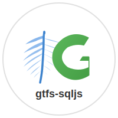

<div align="center">
  
  <h1>gtfs-sqljs</h1>

  [](https://www.npmjs.com/package/gtfs-sqljs)

  <p>A TypeScript library for loading <a href="https://gtfs.org/documentation/schedule/reference/">GTFS</a> (General Transit Feed Specification) data into a <a href="https://sql.js.org/">sql.js</a> SQLite database for querying in both browser and Node.js environments.</p>
</div>

> **[Live Demo](https://sysdevrun.github.io/gtfs-sqljs-demo/)** — A fully static demo website with GTFS and GTFS-RT data running in a Web Worker, with no backend.

## Author

**Théophile Helleboid / SysDevRun**

- Email: contact@sys-dev-run.fr
- Website: https://www.sys-dev-run.fr/

This project is greatly inspired by [node-gtfs](https://github.com/BlinkTagInc/node-gtfs), also MIT licensed. The main difference is that gtfs-sqljs aims to run on both browser and Node.js environments.

## Documentation & Demo

- [Documentation and Interactive Demo](https://sysdevrun.github.io/gtfs-sqljs/)
- [Usage Guide](https://sysdevrun.github.io/gtfs-sqljs/docs/documents/Usage_Guide.html) — detailed examples for all features
- [API Reference](https://sysdevrun.github.io/gtfs-sqljs/docs/) — full TypeDoc-generated API docs

## Features

### GTFS Static Data
- Load GTFS data from ZIP files (URL or local path)
- **High-performance loading** with optimized bulk inserts
- **Progress tracking** - Real-time progress callbacks (0-100%)
- Skip importing specific files (e.g., shapes.txt) to reduce memory usage
- Load existing SQLite databases
- Export databases to ArrayBuffer for persistence
- Flexible filter-based query API - combine multiple filters easily
- Full TypeScript support with comprehensive types
- Works in both browser and Node.js

### [GTFS Realtime](https://gtfs.org/documentation/realtime/reference/) Support
- Load GTFS-RT data from protobuf feeds (URLs or local files)
- Support for Alerts, Trip Updates, and Vehicle Positions
- Automatic staleness filtering (configurable threshold)
- Merge realtime data with static schedules

### Smart Caching
- **Optional caching** - Copy cache implementations from `examples/cache/`
- **Platform-specific stores** - IndexedDBCacheStore (browser) or FileSystemCacheStore (Node.js)
- **Smart invalidation** - Based on file checksum, size, version, and library version
- **Dramatic speed improvement** - Subsequent loads in <1 second

## Installation

```bash
npm install gtfs-sqljs
```

You also need to install sql.js as a peer dependency:

```bash
npm install sql.js
```

## Quick Start

```typescript
import { GtfsSqlJs } from 'gtfs-sqljs';

// Load GTFS data from a ZIP file
const gtfs = await GtfsSqlJs.fromZip('https://example.com/gtfs.zip');

// Query routes
const routes = gtfs.getRoutes();

// Query stops with filters
const stops = gtfs.getStops({ name: 'Central Station' });

// Get trips for a route on a specific date
const trips = gtfs.getTrips({
  routeId: 'ROUTE_1',
  date: '20240115',
  directionId: 0
});

// Get stop times for a trip
const stopTimes = gtfs.getStopTimes({ tripId: trips[0].trip_id });

// Clean up
gtfs.close();
```

For detailed usage examples, see the [Usage Guide](https://sysdevrun.github.io/gtfs-sqljs/docs/documents/Usage_Guide.html).

## API Reference

Full API documentation: [API Reference](https://sysdevrun.github.io/gtfs-sqljs/docs/)

### Static Methods

- `GtfsSqlJs.fromZip(zipPath, options?)` - Create instance from GTFS ZIP file path or URL
- `GtfsSqlJs.fromZipData(zipData, options?)` - Create instance from pre-loaded GTFS ZIP data (`ArrayBuffer` or `Uint8Array`)
- `GtfsSqlJs.fromDatabase(database, options?)` - Create instance from existing database

### Instance Methods

#### GTFS Static Data Methods
All methods support flexible filtering with both single values and arrays:

- `getAgencies(filters?)` - Get agencies (filters: agencyId, limit)
- `getStops(filters?)` - Get stops (filters: stopId, stopCode, name, tripId, limit)
- `getRoutes(filters?)` - Get routes (filters: routeId, agencyId, limit)
- `getTrips(filters?)` - Get trips (filters: tripId, routeId, serviceIds, directionId, agencyId, includeRealtime, limit, date)
- `getStopTimes(filters?)` - Get stop times (filters: tripId, stopId, routeId, serviceIds, directionId, agencyId, includeRealtime, limit, date)
- `getShapes(filters?)` - Get shape points (filters: shapeId, routeId, tripId, limit)
- `getShapesToGeojson(filters?, precision?)` - Get shapes as GeoJSON FeatureCollection (same filters, precision default: 6)
- `buildOrderedStopList(tripIds)` - Build an ordered list of stops from multiple trips (handles express/local variations)

#### Calendar Methods
- `getActiveServiceIds(date)` - Get active service IDs for a date (YYYYMMDD format)
- `getCalendars(filters?)` - Get calendars (filters: serviceId, limit)
- `getCalendarDates(serviceId)` - Get calendar date exceptions for a service
- `getCalendarDatesForDate(date)` - Get calendar exceptions for a specific date

#### GTFS Realtime Methods
- `fetchRealtimeData(urls?)` - Fetch and load RT data from protobuf feeds
- `clearRealtimeData()` - Clear all realtime data from database
- `setRealtimeFeedUrls(urls)` - Configure RT feed URLs
- `getRealtimeFeedUrls()` - Get configured RT feed URLs
- `setStalenessThreshold(seconds)` - Set staleness threshold (default: 120 seconds)
- `getStalenessThreshold()` - Get current staleness threshold
- `getLastRealtimeFetchTimestamp()` - Get Unix timestamp (seconds) of last successful RT fetch, or null if never fetched
- `getAlerts(filters?)` - Get alerts (filters: alertId, routeId, stopId, tripId, activeOnly, cause, effect, limit)
- `getVehiclePositions(filters?)` - Get vehicle positions (filters: tripId, routeId, vehicleId, limit)
- `getTripUpdates(filters?)` - Get trip updates (filters: tripId, routeId, limit)
- `getStopTimeUpdates(filters?)` - Get stop time updates (filters: tripId, stopId, stopSequence, limit)

#### Database Methods
- `export()` - Export database to ArrayBuffer (includes RT data)
- `getDatabase()` - Get direct access to sql.js database for advanced queries
- `close()` - Close database connection

#### Debug Methods
- `debugExportAllAlerts()` - Export all alerts without staleness filtering
- `debugExportAllVehiclePositions()` - Export all vehicle positions without staleness filtering
- `debugExportAllTripUpdates()` - Export all trip updates without staleness filtering
- `debugExportAllStopTimeUpdates()` - Export all stop time updates without staleness filtering

## TypeScript Support

This library is written in TypeScript and provides full type definitions for all GTFS entities, filter options, GTFS-RT types, and progress tracking:

```typescript
import type {
  // Static GTFS types
  Stop, Route, Trip, StopTime, Shape,
  TripFilters, StopTimeFilters, ShapeFilters,
  // GeoJSON types
  GeoJsonFeatureCollection,
  // GTFS-RT types
  Alert, VehiclePosition, TripWithRealtime, StopTimeWithRealtime,
  AlertFilters, VehiclePositionFilters,
  // GTFS-RT enums
  AlertCause, AlertEffect, ScheduleRelationship,
  // Progress tracking types
  ProgressInfo, ProgressCallback
} from 'gtfs-sqljs';
```

## GTFS Specification

This library implements:
- [GTFS Schedule Reference](https://gtfs.org/schedule/reference/) with proper handling of required and optional fields
- [GTFS Realtime Reference v2.0](https://gtfs.org/realtime/reference/) with support for Alerts, Trip Updates, and Vehicle Positions

## License

MIT

## Contributing

Contributions are welcome! Please feel free to submit a Pull Request.

## Issues

If you encounter any problems or have suggestions, please [open an issue](https://github.com/sysdevrun/gtfs-sqljs/issues).
